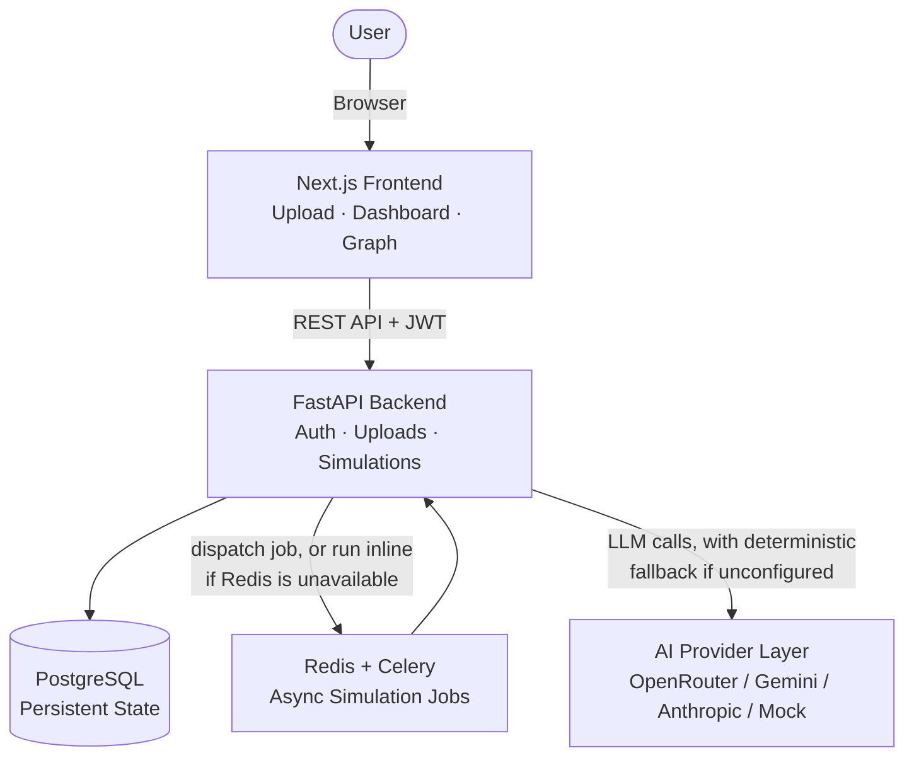
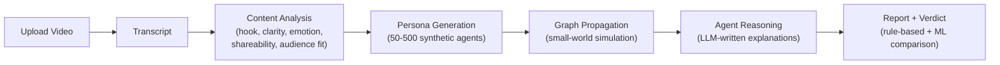
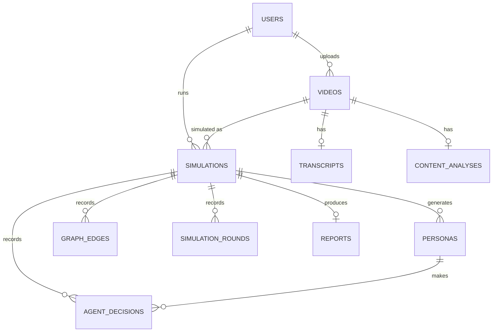

# Reachlytics

**AI-assisted content analytics platform for predicting how product demo videos spread across synthetic social audiences.**

[](https://github.com/nayana3333/Reachlytics/actions/workflows/ci.yml)
[](https://nextjs.org/)
[](https://fastapi.tiangolo.com/)
[](https://www.postgresql.org/)
[](https://networkx.org/)
[](docs/model_evaluation.md)
[](LICENSE)

Reachlytics turns a vague marketing question into a measurable simulation problem:

> Given a product demo video and a target audience, how far can the content spread, who engages, and why?

The platform combines video upload, content analysis, synthetic persona generation, graph-based propagation, SQL-backed analytics, ML verdict prediction, and explainable per-agent reasoning. It is built as a placement-ready full-stack project with production-shaped backend design, database persistence, migration safety, background-job architecture, and transparent AI fallback behavior.

## Table of Contents

- [Preview](#preview)
- [Live Demo](#live-demo--repository)
- [What It Does](#what-it-does)
- [Engineering Highlights](#engineering-highlights)
- [Tech Stack](#tech-stack)
- [System Architecture](#system-architecture)
- [Simulation Pipeline](#simulation-pipeline)
- [Core Data Model](#core-data-model)
- [Simulation and Verdict Logic](#simulation-and-verdict-logic)
- [Analytics and ML](#analytics-and-ml)
- [AI Provider Strategy](#ai-provider-strategy)
- [Quick Start](#quick-start)
- [Testing](#testing)
- [Project Structure](#project-structure)
- [API Reference](#api-reference)
- [Deployment](#deployment)
- [Known Limitations](#known-limitations)
- [Roadmap](#roadmap)
- [Project Documentation](#project-documentation)
- [Resume Bullets](#resume-bullets)
- [License](#license)

## Preview


> **Adding more visuals:** the screenshot above is the current landing/simulation view. If you're reading this as a maintainer preparing for interviews, the highest-value next additions are: a screenshot of the `/dashboard` list view, a screenshot of a completed `/simulations/[id]` report (metrics + graph + verdict panel), and a 30-60s screen recording of the upload-to-report flow (a free tool like [ScreenToGif](https://www.screentogif.com/) or [Loom](https://www.loom.com/) works well). Drop the images into `docs/assets/` and the video onto YouTube/Loom, then add them here — the sections below are already structured to slot them in.

## Live Demo & Repository

- **Frontend demo:** https://reachlytics.vercel.app
- **GitHub:** https://github.com/nayana3333/Reachlytics
- **Full-stack local run:** `docker compose up --build`
- **Project report:** [PROJECT_REPORT.md](PROJECT_REPORT.md)
- **Deployment guide:** [DEPLOYMENT.md](DEPLOYMENT.md)

> The Vercel link hosts the frontend. Login, upload, and simulation require the FastAPI backend, which can be run locally with Docker Compose or deployed separately using the included Render configuration.

## What It Does

1. Upload a product demo video.
2. Select a target audience.
3. Extract transcript/video context.
4. Score the content for hook, clarity, emotional appeal, shareability, and audience fit.
5. Generate synthetic social personas with interests, pain points, and behavior traits.
6. Simulate multi-round propagation across a graph network.
7. Produce reach, engagement rates, cascade depth, verdict, graph spread, and improvement suggestions.

## Engineering Highlights

- **Full-stack architecture:** Next.js frontend, FastAPI backend, PostgreSQL persistence, Dockerized services.
- **Graph simulation:** NetworkX Watts-Strogatz small-world propagation engine models realistic multi-round social spread — tight local clusters plus long-range shortcuts, not a plain random graph.
- **Persona-level reasoning:** Each reached agent has deterministic watch/like/comment/share decisions plus an LLM-written (or deterministic fallback) explanation — the model never decides the outcome, only narrates it, keeping simulations reproducible.
- **SQL analytics:** A 7-query pack for run summaries, audience comparison, engagement funnels, verdict distribution, and AI-source auditing.
- **ML evaluation:** Random Forest verdict classifier with documented **74.2% accuracy** and full explainability support — [confusion matrix, per-class breakdown, and feature-importance plot](docs/model_evaluation.md).
- **Validation:** Rule-based verdict engine tested across **194,481 metric combinations** with no gaps — a formal proof the verdict ladder is total over its input space, not just spot-checked.
- **AI transparency:** Every pipeline stage is tagged as real AI or deterministic fallback, so the UI never overstates how "real" a result is.
- **Continuous Integration:** GitHub Actions runs the backend test suite, the verdict-space validation, and frontend lint/typecheck/build on every push — [see the workflow](.github/workflows/ci.yml).
- **Deployment-ready:** Vercel frontend config, Render backend blueprint, Docker Compose local stack.

## Tech Stack

| Layer | Tools |
| --- | --- |
| Frontend | Next.js, React, TypeScript, Tailwind CSS, React Flow |
| Backend | FastAPI, Python, SQLAlchemy |
| Database | PostgreSQL, Alembic migrations |
| Queue | Redis + Celery with inline fallback mode |
| Simulation | NetworkX (Watts-Strogatz small-world graph) |
| AI Providers | OpenRouter, Gemini, Anthropic/OpenAI, offline mock mode |
| ML | Random Forest, SHAP/feature-importance explainability |
| Auth | JWT (python-jose) + bcrypt password hashing |
| CI/CD | GitHub Actions, Docker, Render blueprint, Vercel frontend |

## System Architecture



## Simulation Pipeline

Every simulation run walks through the same seven stages, whether it executes as a Celery background job or synchronously inline:



Each stage's result is tagged as real AI or deterministic fallback, and the pipeline is fully functional with zero API keys configured (`AI_PROVIDER=mock`).

## Core Data Model

Reachlytics stores the complete simulation trace across 10 related tables:



- `users`: authenticated users
- `videos`: uploaded video metadata
- `transcripts`: transcript or video description plus AI-source status
- `content_analyses`: content quality scores and visual description
- `simulations`: target audience, status, metrics, final verdict
- `personas`: synthetic audience profiles and behavioral traits
- `agent_decisions`: per-persona watch/like/comment/share/skip decisions
- `graph_edges`: propagation links between personas
- `simulation_rounds`: round-level reach and engagement
- `reports`: final summary, risks, suggestions, and ML verdict prediction

## Simulation and Verdict Logic

The propagation engine exposes seed personas first (the highest interest-match + engagement-tendency agents, not random), then expands reach based on engagement behavior. Shares create stronger fanout; likes and comments create smaller algorithmic pushes.

The final verdict is rule-based and explicit, not a hidden prompt. Supported verdicts:

- `Viral candidate`
- `Niche hit`
- `Solid in-target performance`
- `Strong in-demo, no breakout`
- `Mixed performance`
- `Low signal`
- `Out-of-target breakout`

Validation script:

```bash
python backend/scripts/validate_verdict_space.py
```

Verified result:

```text
Checked 194481 metric combinations.
No gaps or unexpected labels found.
```

## Analytics and ML

The project includes analytics artifacts for decision-science style review:

- [SQL analytics pack](docs/sql_analytics_queries.sql): report summaries, audience comparison, funnels, persona behavior, AI-source audit.
- [Model evaluation notes](docs/model_evaluation.md): classifier framing, real per-class precision/recall, confusion matrix, feature-importance plot, and an explanation of predictive vs. circular models.
- **Pre-simulation Random Forest classifier**: documented **74.2% accuracy** (macro F1 0.69) on a balanced, simulator-generated dataset — this is the legitimate predictive component, called out explicitly to avoid overclaiming.
- **Post-simulation classifier**: documented as an explainer/sanity check (98.3% accuracy, which is expected and circular since its labels come from the same deterministic function as its features) — not presented as a second predictive achievement.

## AI Provider Strategy

Reachlytics supports multiple provider modes, each independently coded with its own deterministic fallback:

| Mode | Purpose |
| --- | --- |
| `mock` | Fully offline deterministic demo — zero API keys required |
| `openrouter` | Free-tier-friendly live AI testing |
| `gemini` | Google AI Studio text/vision/audio path |
| `anthropic` | Anthropic reasoning/vision + OpenAI Whisper transcription |

The UI exposes whether transcript, content analysis, persona generation, and reasoning used live AI or fallback logic, down to which provider and whether visual (multimodal) inspection was used.

## Quick Start

```bash
docker compose up --build
```

Services:

- Frontend: http://localhost:3000
- Backend: http://localhost:8000
- API docs: http://localhost:8000/docs

Backend-only development:

```bash
docker compose up postgres redis
cd backend
copy .env.example .env
python -m venv .venv
.venv\Scripts\activate
pip install -r requirements.txt
alembic upgrade head
uvicorn app.main:app --reload
```

Frontend-only development:

```bash
cd frontend
npm install
npm run dev
```

## Testing

```bash
cd backend
python -m pytest tests
```

29 tests across unit (scoring formulas, verdict boundaries, persona/reason generation, every AI-provider branch) and integration (auth flow, upload validation, the end-to-end "every completed simulation has a report" contract) suites — all running against a hermetic in-memory database and mocked AI provider, so nothing depends on real API keys or external services.

Run verdict-space validation:

```bash
python backend/scripts/validate_verdict_space.py
```

Regenerate ML artifacts:

```bash
cd backend
python scripts/generate_training_data.py
python scripts/train_verdict_classifier.py
```

Generated ML artifacts are intentionally excluded from Git to keep the repository lightweight; regenerate them locally whenever needed.

Frontend checks:

```bash
cd frontend
npm run lint
npm run typecheck
npm run build
```

All of the above run automatically on every push via [GitHub Actions](.github/workflows/ci.yml).

## Project Structure

```text
Reachlytics/
├── backend/
│   ├── app/
│   │   ├── api/routes/       # auth, videos, simulations endpoints
│   │   ├── services/         # transcript, content analysis, personas, reasoning, reports
│   │   ├── simulation/       # graph builder, propagation engine, scoring formulas
│   │   ├── ai/                # LLM provider abstraction (OpenRouter/Gemini/Anthropic) + prompts
│   │   ├── ml/                 # verdict classifier loading/inference
│   │   ├── models/           # SQLAlchemy models
│   │   ├── schemas/           # Pydantic request/response contracts
│   │   ├── workers/           # Celery task + app
│   │   ├── core/               # config, security, logging, schema guard
│   │   └── db/                 # session/engine setup
│   ├── migrations/            # Alembic migrations (6, incremental)
│   ├── scripts/                # ML training data generation, training, verdict-space validation
│   └── tests/                  # unit + integration tests, hermetic conftest
├── frontend/
│   ├── app/                    # Next.js App Router pages
│   ├── components/            # auth, dashboard, simulation, upload, ui primitives
│   ├── hooks/                  # useAuthGuard
│   └── lib/                    # API client, shared types
├── docs/                        # SQL analytics pack, model evaluation, screenshots
├── .github/workflows/          # CI pipeline
├── docker-compose.yml
├── render.yaml                 # Render deployment blueprint
└── DEPLOYMENT.md
```

## API Reference

Full interactive OpenAPI/Swagger documentation is available at `/docs` on any running backend instance (e.g. http://localhost:8000/docs). Key routes:

| Method | Route | Purpose |
| --- | --- | --- |
| `POST` | `/api/auth/register` | Create an account |
| `POST` | `/api/auth/login` | Get a JWT access token |
| `GET` | `/api/auth/me` | Current user |
| `POST` | `/api/videos/upload` | Upload a demo video (multipart) |
| `GET` | `/api/videos` | List your videos |
| `POST` | `/api/simulations` | Start a simulation (video + target audience + persona/round count) |
| `GET` | `/api/simulations/{id}/status` | Poll live progress |
| `GET` | `/api/simulations/{id}/metrics` | Final metrics |
| `GET` | `/api/simulations/{id}/graph` | Persona graph + layout |
| `GET` | `/api/simulations/{id}/rounds` | Round-by-round propagation |
| `GET` | `/api/simulations/{id}/personas` | Full persona list + decisions |
| `GET` | `/api/simulations/{id}/report` | Final report + verdict comparison |

## Deployment

Deployment files are included:

- `render.yaml`: Render backend + PostgreSQL blueprint
- `DEPLOYMENT.md`: full deployment instructions and environment variables
- Frontend is deployed on Vercel from the `frontend` directory

Recommended first deployment:

| Service | Platform |
| --- | --- |
| Frontend | Vercel |
| Backend | Render web service |
| Database | Render PostgreSQL |
| Queue | Inline mode for first public demo |

Redis/Celery production mode should be paired with shared object storage for uploaded videos, since a separate worker process can't see the web service's local disk — see [DEPLOYMENT.md](DEPLOYMENT.md) for the full reasoning.

## Known Limitations

Documented honestly rather than discovered by a reviewer:

- No automated frontend test suite yet (backend has 29 tests; frontend relies on lint/typecheck/build).
- The post-simulation "explainer" ML model is intentionally not a second predictive model — see [Analytics and ML](#analytics-and-ml).
- Production Celery/Redis requires shared object storage (S3 or similar) for uploaded videos before a separate worker can be safely deployed; the first hosted deployment intentionally runs inline.
- ML model artifacts (`.joblib` files) are not committed to keep the repo lightweight — regenerate them with the scripts above before relying on `ml_verdict_prediction` output.

## Roadmap

- WebSocket progress updates (replacing 5-second polling)
- PDF report export
- A/B testing between two uploaded videos
- Shared object storage for production video uploads, enabling a real Celery worker deployment
- LLM-generated report summaries (reports are currently template-based, not AI-generated)
- Frontend automated test coverage

## Project Documentation

- [PROJECT_REPORT.md](PROJECT_REPORT.md): problem framing, architecture, data model, simulation logic, business interpretation
- [DEPLOYMENT.md](DEPLOYMENT.md): deployment setup for frontend/backend
- [docs/sql_analytics_queries.sql](docs/sql_analytics_queries.sql): SQL analytics pack
- [docs/model_evaluation.md](docs/model_evaluation.md): model evaluation and honest ML framing

## Resume Bullets

```latex
\resumeProjectHeading
    {\textbf{\href{https://github.com/nayana3333/Reachlytics}{Reachlytics}} $|$ \emph{FastAPI, Next.js, PostgreSQL, Redis, Celery, NetworkX, SQL, ML, LLM APIs}}{2026}
    \resumeItemListStart
      \resumeItem{Built an AI content analytics platform to support \textbf{data-driven content strategy decisions}, simulating product video spread across \textbf{200+ synthetic personas} using \textbf{NetworkX} graph propagation and PostgreSQL-backed analytics}
      \resumeItem{Designed \textbf{SQL}-based analytics workflows for audience comparison, engagement funnels, verdict distribution, and AI-source auditing; validated rule-based verdict logic across \textbf{194,481 metric combinations}}
      \resumeItem{Trained a \textbf{Random Forest} verdict classifier with \textbf{74\% accuracy} and explainability support, while integrating LLM-based persona generation, content analysis, and deterministic fallback for reliable demos}
      \resumeItem{Set up \textbf{CI/CD} with GitHub Actions running backend tests, an exhaustive verdict-rule validation, and frontend lint/typecheck/build on every push}
    \resumeItemListEnd
```

## License

Licensed under the [MIT License](LICENSE).
