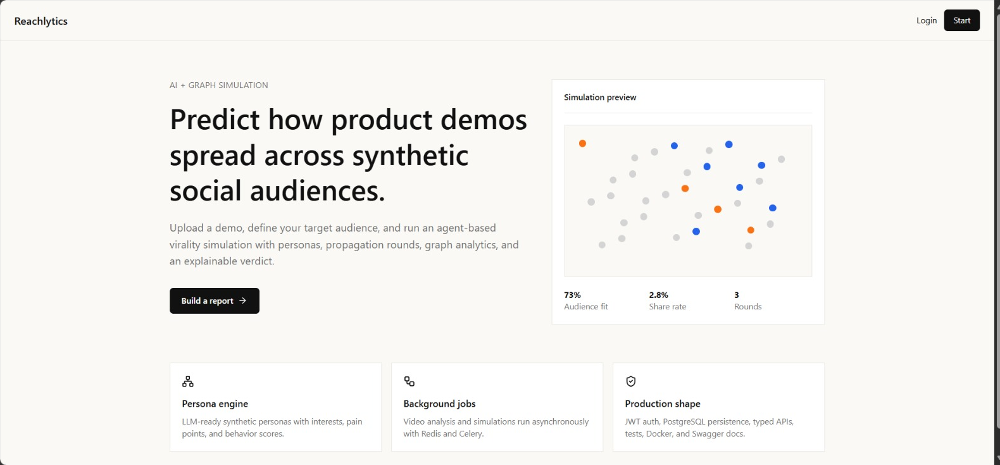

# Reachlytics

**AI-assisted content analytics platform for predicting how product demo videos spread across synthetic social audiences.**

[](https://nextjs.org/)
[](https://fastapi.tiangolo.com/)
[](https://www.postgresql.org/)
[](https://networkx.org/)
[](docs/model_evaluation.md)

Reachlytics turns a vague marketing question into a measurable simulation problem:

> Given a product demo video and a target audience, how far can the content spread, who engages, and why?

The platform combines video upload, content analysis, synthetic persona generation, graph-based propagation, SQL-backed analytics, ML verdict prediction, and explainable per-agent reasoning. It is built as a placement-ready full-stack project with production-shaped backend design, database persistence, migration safety, background-job architecture, and transparent AI fallback behavior.

## Preview



## Live and Repository

- Frontend demo: https://reachlytics.vercel.app
- GitHub: https://github.com/nayana3333/Reachlytics
- Full-stack local run: `docker compose up --build`
- Project report: [PROJECT_REPORT.md](PROJECT_REPORT.md)
- Deployment guide: [DEPLOYMENT.md](DEPLOYMENT.md)

> The Vercel link hosts the frontend. Login, upload, and simulation require the FastAPI backend, which can be run locally with Docker Compose or deployed separately using the included Render configuration.

## What It Does

1. Upload a product demo video.
2. Select a target audience.
3. Extract transcript/video context.
4. Score the content for hook, clarity, emotional appeal, shareability, and audience fit.
5. Generate synthetic social personas with interests, pain points, and behavior traits.
6. Simulate multi-round propagation across a graph network.
7. Produce reach, engagement rates, cascade depth, verdict, graph spread, and improvement suggestions.

## Engineering Highlights

- **Full-stack architecture:** Next.js frontend, FastAPI backend, PostgreSQL persistence, Dockerized services.
- **Graph simulation:** NetworkX-style propagation engine models multi-round social spread.
- **Persona-level reasoning:** Each reached agent has watch/like/comment/share decisions and an explanation.
- **SQL analytics:** Query pack for funnels, audience comparison, verdict distribution, and AI-source auditing.
- **ML evaluation:** Random Forest verdict classifier with documented 78.3% accuracy and explainability support.
- **Validation:** Rule-based verdict engine tested across **194,481 metric combinations** with no gaps.
- **AI transparency:** Every stage is tagged as real AI or deterministic fallback, avoiding misleading output.
- **Deployment-ready:** Vercel frontend config, Render backend blueprint, Docker Compose local stack.

## Tech Stack

| Layer | Tools |
| --- | --- |
| Frontend | Next.js, React, TypeScript, Tailwind CSS, React Flow |
| Backend | FastAPI, Python, SQLAlchemy |
| Database | PostgreSQL, Alembic migrations |
| Queue | Redis + Celery with inline fallback mode |
| Simulation | NetworkX-style graph propagation |
| AI Providers | OpenRouter, Gemini, Anthropic/OpenAI, offline mock mode |
| ML | Random Forest, SHAP/feature-importance explainability |
| DevOps | Docker Compose, Render blueprint, Vercel frontend |

## System Architecture

```text
                    +-----------------------------+
                    |        Next.js Frontend     |
                    |  Upload / Dashboard / Graph |
                    +--------------+--------------+
                                   |
                                   | REST API
                                   v
                    +-----------------------------+
                    |        FastAPI Backend      |
                    | Auth / Uploads / Simulation |
                    +--------------+--------------+
                                   |
                 +-----------------+------------------+
                 |                                    |
                 v                                    v
        +------------------+                 +------------------+
        |   PostgreSQL     |                 | Redis + Celery   |
        | Persistent State |                 | Async Jobs       |
        +------------------+                 +------------------+
                 |
                 v
 Transcript -> Content Analysis -> Personas -> Propagation -> Report
```

## Core Data Model

Reachlytics stores the complete simulation trace:

- `users`: authenticated users
- `videos`: uploaded video metadata
- `transcripts`: transcript or video description plus AI-source status
- `content_analyses`: content quality scores and visual description
- `simulations`: target audience, status, metrics, final verdict
- `personas`: synthetic audience profiles and behavioral traits
- `agent_decisions`: per-persona watch/like/comment/share/skip decisions
- `graph_edges`: propagation links between personas
- `simulation_rounds`: round-level reach and engagement
- `reports`: final summary, risks, suggestions, and ML verdict prediction

## Simulation and Verdict Logic

The propagation engine exposes seed personas first, then expands reach based on engagement behavior. Shares create stronger fanout; likes and comments create smaller algorithmic pushes.

The final verdict is rule-based and explicit, not a hidden prompt. Supported verdicts include:

- `Viral candidate`
- `Niche hit`
- `Solid in-target performance`
- `Strong in-demo, no breakout`
- `Mixed performance`
- `Low signal`
- `Out-of-target breakout`

Validation script:

```bash
python backend/scripts/validate_verdict_space.py
```

Verified result:

```text
Checked 194481 metric combinations.
No gaps or unexpected labels found.
```

## Analytics and ML

The project includes analytics artifacts for decision-science style review:

- [SQL analytics pack](docs/sql_analytics_queries.sql): report summaries, audience comparison, funnels, persona behavior, AI-source audit.
- [Model evaluation notes](docs/model_evaluation.md): classifier framing, class balance, and explanation of predictive vs circular models.
- Pre-simulation Random Forest classifier: documented **78.3% accuracy** on a balanced simulator-generated dataset.
- Post-simulation classifier is documented as an explainer/sanity check, not overclaimed as a predictive achievement.

## AI Provider Strategy

Reachlytics supports multiple provider modes:

| Mode | Purpose |
| --- | --- |
| `mock` | Fully offline deterministic demo |
| `openrouter` | Free-tier-friendly live AI testing |
| `gemini` | Google AI Studio text/vision/audio path |
| `anthropic` | Anthropic reasoning/vision + OpenAI Whisper transcription |

The UI exposes whether transcript, content analysis, persona generation, and reasoning used live AI or fallback logic.

## Quick Start

```bash
docker compose up --build
```

Services:

- Frontend: http://localhost:3000
- Backend: http://localhost:8000
- API docs: http://localhost:8000/docs

Backend-only development:

```bash
docker compose up postgres redis
cd backend
copy .env.example .env
python -m venv .venv
.venv\Scripts\activate
pip install -r requirements.txt
alembic upgrade head
uvicorn app.main:app --reload
```

Frontend-only development:

```bash
cd frontend
npm install
npm run dev
```

## Testing

```bash
cd backend
python -m pytest tests
```

Run verdict-space validation:

```bash
python backend/scripts/validate_verdict_space.py
```

Regenerate ML artifacts:

```bash
cd backend
python scripts/generate_training_data.py
python scripts/train_verdict_classifier.py
```

Generated ML artifacts are intentionally excluded from Git to keep the repository lightweight.

## Deployment

Deployment files are included:

- `render.yaml`: Render backend + PostgreSQL blueprint
- `DEPLOYMENT.md`: deployment instructions and environment variables
- Frontend is deployed on Vercel from the `frontend` directory

Recommended first deployment:

| Service | Platform |
| --- | --- |
| Frontend | Vercel |
| Backend | Render web service |
| Database | Render PostgreSQL |
| Queue | Inline mode for first public demo |

Redis/Celery production mode should be paired with shared object storage for uploaded videos.

## Project Documentation

- [PROJECT_REPORT.md](PROJECT_REPORT.md): problem framing, architecture, data model, simulation logic, business interpretation
- [DEPLOYMENT.md](DEPLOYMENT.md): deployment setup for frontend/backend
- [docs/sql_analytics_queries.sql](docs/sql_analytics_queries.sql): SQL analytics pack
- [docs/model_evaluation.md](docs/model_evaluation.md): model evaluation and honest ML framing

## Resume Bullets

```latex
\resumeProjectHeading
    {\textbf{\href{https://github.com/nayana3333/Reachlytics}{Reachlytics}} $|$ \emph{FastAPI, Next.js, PostgreSQL, Redis, Celery, NetworkX, SQL, ML, LLM APIs}}{2026}
    \resumeItemListStart
      \resumeItem{Built an AI content analytics platform to support \textbf{data-driven content strategy decisions}, simulating product video spread across \textbf{200+ synthetic personas} using \textbf{NetworkX} graph propagation and PostgreSQL-backed analytics}
      \resumeItem{Designed \textbf{SQL}-based analytics workflows for audience comparison, engagement funnels, verdict distribution, and AI-source auditing; validated rule-based verdict logic across \textbf{194,481 metric combinations}}
      \resumeItem{Trained a \textbf{Random Forest} verdict classifier with \textbf{78\% accuracy} and explainability support, while integrating LLM-based persona generation, content analysis, and deterministic fallback for reliable demos}
    \resumeItemListEnd
```

## Interview Talking Points

- Why graph simulation is useful for modeling content spread
- How persona-level scoring converts qualitative audience behavior into measurable decisions
- Why SQL analytics are useful for comparing target audiences and simulation outcomes
- How the verdict validation script prevents silent rule gaps
- Why the post-simulation ML model is treated as an explainer, not a predictive claim
- How the system can scale with shared storage, Redis/Celery, and managed deployment

## Future Improvements

- WebSocket progress updates
- PDF report export
- A/B testing between two uploaded videos
- Shared object storage for production video uploads
- Redis/Celery production queue with shared upload storage
- CI/CD pipeline for backend and frontend checks
