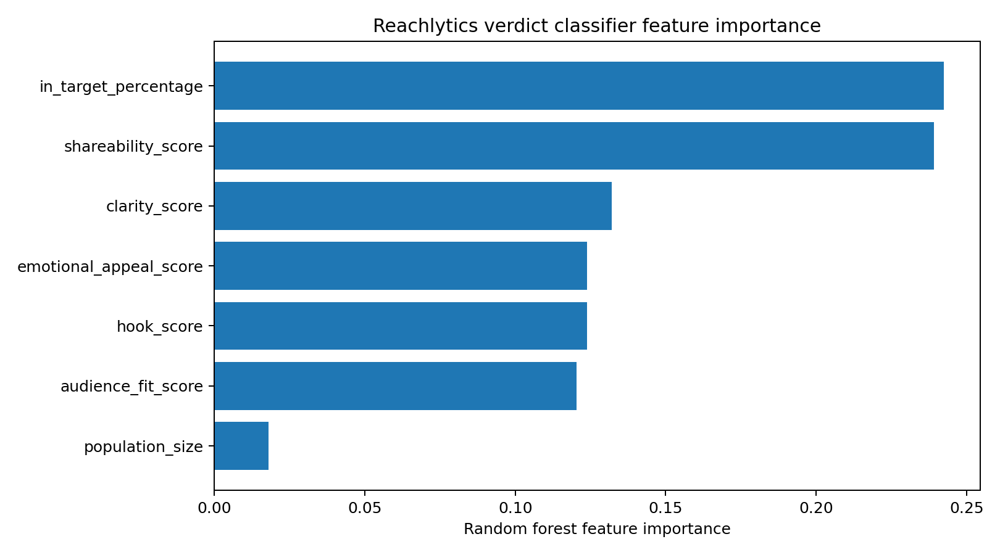

# Reachlytics Model Evaluation Notes

Reachlytics is framed as a decision-science project, so the ML and simulation claims should be presented honestly. The project has three separate layers:

1. Rule-based verdict logic that maps final simulation metrics to one of seven documented labels.
2. A pre-simulation Random Forest model that predicts the likely verdict before propagation runs.
3. A post-simulation Random Forest explainer that recovers the rule-based verdict from final metrics.

## Verdict-Space Validation

The core `verdict()` function is deterministic and intentionally documented with explicit thresholds. To avoid silent fallthrough bugs, the project includes a standalone validation script that checks 194,481 metric combinations:

```bash
cd backend
python scripts/validate_verdict_space.py
```

The script steps `share_rate`, `out_of_target_rate`, `like_rate`, and `normalized_reach` from `0.00` to `1.00` in increments of `0.05`. Every combination must return exactly one of the seven approved labels:

- `Viral candidate`
- `Niche hit`
- `Solid in-target performance`
- `Strong in-demo, no breakout`
- `Mixed performance`
- `Low signal`
- `Out-of-target breakout`

This is a quality-control check for the simulation rules. It is not an ML accuracy claim.

## Pre-Simulation Verdict Classifier

The legitimate predictive model is `verdict_classifier.joblib`. It predicts a verdict before graph propagation runs using features such as content scores, population size, in-target percentage, and round count.

Training data is generated by running simulator scenarios:

```bash
cd backend
python scripts/generate_training_data.py
python scripts/train_verdict_classifier.py
```

Current documented run (regenerate anytime with the two commands above — `--seed 42` makes `generate_training_data.py` reproducible, though `train_test_split`'s own internal split can still shift results slightly run to run):

- 600 simulator-generated rows
- Verdict distribution: Low signal 217, Strong in-demo no breakout 94, Mixed performance 73, Viral candidate 67, Niche hit 51, Out-of-target breakout 49, Solid in-target performance 49
- Random Forest classifier (350 trees, `class_weight="balanced_subsample"`)
- **74.17% pre-simulation accuracy** (macro F1 0.69) on a held-out 20% test split (120 rows)

Per-class precision/recall (test split, 120 rows):

| Verdict | Precision | Recall | F1 | Support |
|---|---|---|---|---|
| Low signal | 0.93 | 0.91 | 0.92 | 43 |
| Mixed performance | 0.50 | 0.40 | 0.44 | 15 |
| Niche hit | 0.67 | 0.60 | 0.63 | 10 |
| Out-of-target breakout | 0.86 | 0.60 | 0.71 | 10 |
| Solid in-target performance | 0.56 | 1.00 | 0.71 | 10 |
| Strong in-demo, no breakout | 0.61 | 0.58 | 0.59 | 19 |
| Viral candidate | 0.79 | 0.85 | 0.81 | 13 |

The model is strongest on the two most common, most distinct classes (`Low signal`, `Viral candidate`) and weakest on `Mixed performance` — which makes sense, since "mixed" is the catch-all label sitting between several other thresholds in the rule ladder, so it's the easiest one for the model to confuse with its neighbors.

Feature importance (this run's top 3, from the fallback plot below): `in_target_percentage` (0.24), `shareability_score` (0.24), `clarity_score` (0.13) — audience fit and shareability dominate, which lines up with how `virality_score` itself is weighted in `scoring.py`.



This run used the matplotlib feature-importance fallback, not a SHAP summary plot — `shap` requires compiling a native C++ extension, which needs Microsoft's C++ Build Tools that weren't installed in this environment. `train_verdict_classifier.py::save_shap_summary` already catches exactly this case and falls back automatically, so nothing broke — it's a live demonstration of the same "degrade gracefully" pattern used throughout the project (see the AI-provider fallbacks). Installing `shap`'s build prerequisites and re-running would produce a proper SHAP summary plot instead.

This is the model to discuss as the predictive component in interviews.

## Post-Simulation Explainer

The post-simulation model is intentionally not presented as a real prediction task. Its labels are generated by the deterministic `verdict()` function from the same final metrics used as model features.

That means very high accuracy is expected and circular. In this run it scored **98.33% accuracy** (nearly perfect per-class precision/recall, confusing only 2 of 19 "Strong in-demo, no breakout" rows with "Solid in-target performance" — two labels with adjacent thresholds in the rule ladder). This is exactly the expected outcome, not an impressive one: its value is limited to sanity checking and interpretability, confirming that a simple model can recover the rule boundaries from final metric data almost perfectly, because those boundaries are themselves simple linear thresholds on the same features it was given.

Use this wording in interviews:

> The pre-simulation classifier is the predictive model. The post-simulation classifier is only an explainer/sanity check because it learns labels produced from the same final metrics.

## Why This Matters For Decision Science

Reachlytics decomposes the business question into measurable parts:

- Content quality: hook, clarity, emotional appeal, shareability, audience fit
- Audience fit: target vs out-of-target reach
- Network behavior: propagation depth, reach, and engagement conversion
- Decision output: verdict label, improvement suggestions, and explainable persona reactions

This makes the project useful for roles that care about SQL, model evaluation, root-cause analysis, and business-facing recommendations.
